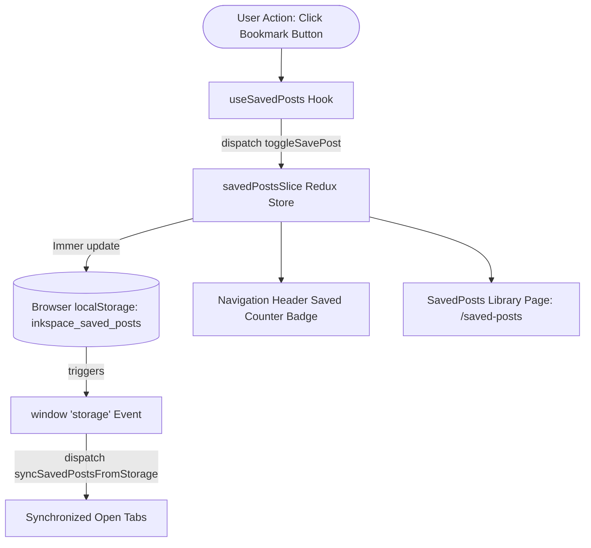

# InkSpace — Production-Grade Blogging Platform & Multi-Aesthetic Design System

InkSpace is a modern, full-stack publishing platform engineered with **React 19**, **Vite**, **Redux Toolkit**, and **Appwrite BaaS**, featuring a groundbreaking **Two-Dimensional Multi-Aesthetic Design System Engine** and an offline-resilient **Saved Posts & Reading List System**.

Designed and developed from the ground up as an intensive **React Mega Project**, InkSpace moves far beyond typical tutorial apps to tackle the real-world complexities of design token architectures, physics-based UI micro-interactions, hardware-accelerated 3D parallax rendering, and resilient Backend-as-a-Service integrations.

---

## Key Highlights & Core Features

- **Dynamic Two-Dimensional Theming Matrix:** Seamlessly switch between **Light & Dark modes** across **5 completely distinct design aesthetic styles** on the fly without page reloads, layout reflows, or DOM recreation.
- **5 Curated Design Aesthetics:**
  1. **Porcelain Neumorphism (Soft UI):** Organic extrusions formed by opposing dual-shadow lighting formulas.
  2. **Neo-Brutalism (Cyber-Editorial):** 3px/3.5px ink borders, 0-blur isometric shadows, die-cut sticker badges, and tactile arcade mechanics.
  3. **Claymorphism (Volumetric 3D Putty):** Marshmallow radii, dual inner light/dark dome reflections, and squash-and-stretch putty physics.
  4. **Skeuomorphism (Machined Aluminum & Hardware):** Physical double bevels, CNC-milled anisotropic grain textures, and mechanical push-button depression physics.
  5. **Interactive 3D (Gyroscopic Tilt & Dynamic Glare):** True mathematical 3D perspective, real-time mouse-tracking specular light highlights, and `translateZ` parallax depth layers.
- **Personal Reading List / Bookmark Engine:** Save and unsave articles with persistent `localStorage` synchronization, live navigation counter badge, and real-time cross-tab synchronization.
- **Rich Publishing Pipeline:** Self-hosted TinyMCE rich text editor bundled locally for zero-latency, offline-capable article authoring.
- **Appwrite BaaS Backend:** Real-time session authentication, document databases, storage buckets for high-resolution cover images, and defensive fallbacks.
- **Responsive Architecture:** Fully responsive from 320px mobile screens to 4K ultrawide displays with accessible keyboard navigation and WCAG AAA contrast ratios.

---

## Multi-Aesthetic Design System Architecture

### The Two-Dimensional State Matrix
Modern web applications typically limit theming to a binary light/dark toggle. InkSpace implements a **two-dimensional design matrix** where visual style is completely orthogonal to luminance:

$$\text{Visual State} = (\text{Theme Mode: } \{\text{light}, \text{dark}\}) \times (\text{Aesthetic Style: } \{\text{default}, \text{neo-brutalism}, \text{claymorphism}, \text{skeuomorphism}, \text{interactive-3d}\})$$

Both attributes are managed as native HTML attributes on the root document:
```html
<html data-theme="dark" data-style="neo-brutalism">
```

### Additive Layering & The CSS Token Contract
To prevent layout shifts and keep the React component tree purely semantic (`<header>`, `<main>`, `<article>`, `<button>`), the styling system is constructed as **additive CSS layers** bound by a strict token contract:

1. **`src/styles/tokens.css` (The Contract):** Declares standardized CSS custom properties (`--app-bg`, `--surface-card`, `--radius-card`, `--shadow-card`, `--accent-primary`).
2. **Backward-Compatibility Aliases:** Maps legacy classes (`--neu-bg`, `--neu-shadow-outset`) directly to current tokens, ensuring pre-existing components automatically reflect whatever aesthetic is selected without touching JSX.
3. **`src/styles/themes.css` (The Aggregator):** Imports all styles and orchestrates a smooth `300ms ease` transition across theme and style switches, preventing visual flashes.

---

## The 5 Curated Aesthetics Explained

### 1. Default (Porcelain Neumorphism / Soft UI)
- **Design Philosophy:** Treats the interface as a continuous, soft porcelain or extruded silicone sheet. UI elements do not sit on top of the canvas; they are seamlessly pressed and extruded *from* the background.
- **Lighting Physics:** Simulates a unified 45-degree ambient light source from the upper-left:
  - Specular corner reflection: `-8px -8px 18px rgba(255, 255, 255, 0.95)`
  - Ambient corner shadow: `8px 8px 18px rgba(180, 195, 215, 0.6)`
  - Inset cavities for input wells: `inset 3px 3px 6px ...` paired with `inset -3px -3px 6px ...`

### 2. Neo-Brutalism (Master Cyber-Editorial System)
- **Design Philosophy:** A stark, high-energy rebellion against homogenized corporate minimalism, drawing inspiration from 90s indie zines, pop-art printmaking, and architectural drafting blueprints.
- **Visual Characteristics & Mechanics:**
  - **Zero-Blur Isometric Shadows:** Strictly enforces `blur-radius = 0px` (e.g. `5px 5px 0px #000000`), giving cards the appearance of physical die-cut cardboard slabs hovering above the page.
  - **Tactile Displacement:** On hover, elements translate diagonally backward (`translate(-4px, -4px)`) while expanding their shadow to `9px 9px 0px`. On click (`:active`), elements translate forward (`translate(2px, 2px)`) with shadow collapsing to `1px`, delivering an arcade-cabinet click sensation.
  - **Procedural Drafting Paper Canvas:** A 3-layer procedural grid featuring 1.5px vertical and horizontal gridlines with centered dot matrices.
  - **Die-Cut Sticker Elements:** Vinyl sticker badges rotated at `-1.5deg` and `+1deg` that snap straight (`0deg`) on hover.
  - **Chromatic Palette:** High-contrast Canary Gold (`#FFE600`), Toxic Mint (`#00FFA3`), and Hot Coral (`#FF4D6D`).

### 3. Claymorphism (Volumetric 3D Putty System)
- **Design Philosophy:** Replaces flat planes with bulbous, friendly 3D clay and marshmallow geometry that feels tactile and inflated with air.
- **Volumetric Shading Formulas:**
  - Soft ambient floor occlusion: `0 14px 28px rgba(0, 0, 0, 0.08)`
  - Upper specular dome illumination: `inset 0 4px 10px rgba(255, 255, 255, 0.9)`
  - Lower ambient bounce reflection: `inset 0 -6px 14px rgba(0, 0, 0, 0.06)`
- **Squash-and-Stretch Putty Physics:** Buttons scale down (`scale(0.96)`) on click while their inner reflections compress, mimicking physical putty deformation.

### 4. Skeuomorphism (Luxury Machined Metal & Hardware)
- **Design Philosophy:** Bridges digital software with physical machined hardware, inspired by CNC-milled aluminum unibodies and analog audio interfaces.
- **Optical Precision & Bevel Physics:**
  - Multi-stop linear surface gradients simulate metallic luster catching top-down studio lighting.
  - **Double-Bevel Seams:**
    - Top specular highlight: `inset 0 1px 0 rgba(255, 255, 255, 0.95)`
    - Bottom lip cast shadow: `inset 0 -1px 0 rgba(0, 0, 0, 0.16)`
  - Anisotropic brushed grain micro-gradients on the body canvas.
  - Tactile mechanical button depression with debossed inset drop shadows on click.

### 5. Interactive 3D (Gyroscopic Cursor Tilt & Dynamic Specular Glare)
- **Design Philosophy:** Imbues UI cards with physical weight and gyroscopic depth, responding directly to the user's cursor position.
- **Mathematical Physics:**
  - Parent containers establish true 3D space via `perspective: 1000px` and `transform-style: preserve-3d`.
  - Dynamic cursor tracking calculates tilt angles (`rotateX`, `rotateY`) and injects `--mouse-x` and `--mouse-y` variables.
  - **Dynamic Glare Sheen:** A radial specular gradient overlay tracks the cursor across card surfaces:
    ```css
    background: radial-gradient(circle at var(--mouse-x, 50%) var(--mouse-y, 50%), rgba(255, 255, 255, 0.35) 0%, transparent 60%);
    ```
  - **Parallax Depth Layering:** Inner elements (thumbnails, titles, buttons) use `transform: translateZ(30px)` to float above the card surface in true 3D space.

---

## Saved Posts & Personal Reading List System

InkSpace includes a complete bookmarking engine that operates reliably both online and offline:



- **Redux State Slice (`src/store/savedPostsSlice.js`):**
  - Manages the saved articles list with optimized schema reduction (only serializes core card metadata `$id`, `title`, `featuredImage`, `author`, `savedAt`).
  - Durable persistence to `localStorage` under `inkspace_saved_posts`.
- **Custom React Hook (`src/hooks/useSavedPosts.js`):**
  - Exposes `savedPosts`, `savedCount`, `isSaved(postId)`, `toggleSave(post)`, `removeSaved(postId)`, and `clearAll()`.
  - Automatically synchronizes state across multiple open browser tabs using `window.addEventListener('storage', ...)`.
- **Dedicated Reading List Page (`src/pages/SavedPosts.jsx`):**
  - Accessible via `/saved-posts` or the header bookmark badge.
  - Features real-time search filtering, empty states with one-click navigation to the feed, and bulk clearing controls.

---

## Technology Stack & Architectural Rationale

| Technology | Role | Why It Was Chosen |
|---|---|---|
| **React 19** | Core UI Engine | Modern hook primitives (`useCallback`, `useId`), forward references (`forwardRef`), and declarative JSX rendering. |
| **Vite** | Bundler & Dev Server | Ultra-fast native ES Module Hot Module Replacement (HMR) and optimized Rollup production builds. |
| **Redux Toolkit** | Global State | Centralized single-source-of-truth for authenticated user sessions and saved articles, powered by Immer. |
| **React Router DOM v7** | Client-Side SPA Routing | Centralized shell layout with `<Outlet />`, dynamic URL params (`/post/:slug`), and protected route guards (`AuthLayout`). |
| **Appwrite BaaS** | Backend Infrastructure | Enterprise-grade Account authentication, Document Databases, and binary Storage Buckets without backend boilerplate. |
| **React Hook Form** | Form State Management | Isolates re-renders to active inputs, ref forwarding, and regex-based real-time validations. |
| **Self-Hosted TinyMCE** | WYSIWYG Article Editor | Bundled locally (`license_key: 'gpl'`) for 100% offline functionality without cloud CDN limits or third-party API dependencies. |
| **HTML React Parser** | Safe Rich Text Parser | Safely transforms rich server-stored HTML markup into React Virtual DOM nodes without `dangerouslySetInnerHTML`. |
| **Tailwind CSS v4 & Vanilla CSS** | Styling System | High-performance styling integrating utility classes with bespoke CSS design tokens and micro-interactions. |

---

## System Architecture Diagram

```mermaid
graph TD
    Client[Browser Client]
    
    subgraph UI & Presentation Layer
        Header[Header, Brand Logo & Style Switcher]
        Navigation[Navigation Links & Saved Posts Counter]
        Pages[Pages: Home, AllPosts, SavedPosts, Post, AddPost, EditPost]
        Cards[PostCard & 3D Interactive Slabs]
        Forms[PostForm, Auth Forms & TinyMCE RTE]
    end

    subgraph Theming Engine Matrix
        ThemeMode[Theme Mode: light | dark]
        StyleMode[Style Mode: default | neo-brutalism | claymorphism | skeuomorphism | interactive-3d]
        Tokens[tokens.css & CSS Custom Properties]
        ThemesAggregator[themes.css Aggregator Layer]
    end

    subgraph State & Synchronization Layer
        Router[React Router DOM v7 & Route Guards]
        AuthSlice[Redux authSlice: User Session State]
        SavedSlice[Redux savedPostsSlice: Reading List]
        StorageSync[Cross-Tab LocalStorage Synchronizer]
    end

    subgraph Service Abstraction Layer
        AuthService[Auth Service Class: src/appwrite/auth.js]
        DatabaseService[Database & Storage Service Class: src/appwrite/conf.js]
    end

    subgraph Appwrite BaaS Backend
        AppwriteAuth[Appwrite Account & Sessions]
        AppwriteDB[Appwrite Databases: posts collection]
        AppwriteStorage[Appwrite Storage: images bucket]
    end

    Client --> Router
    Router --> Pages
    Pages --> Cards
    Pages --> Forms
    Header --> ThemeMode
    Header --> StyleMode
    ThemeMode --> Tokens
    StyleMode --> ThemesAggregator
    ThemesAggregator --> Tokens
    Tokens --> Pages
    Tokens --> Cards

    Header --> AuthSlice
    Navigation --> SavedSlice
    Cards --> SavedSlice
    SavedSlice --> StorageSync
    
    Pages --> DatabaseService
    Forms --> DatabaseService
    Header --> AuthService
    Forms --> AuthService
    
    AuthService --> AppwriteAuth
    DatabaseService --> AppwriteDB
    DatabaseService --> AppwriteStorage
```

---

## Project Structure

```
inkspace/
├── public/
│   ├── tinymce/                 # Self-hosted TinyMCE distribution (offline-ready)
│   └── vite.svg
├── src/
│   ├── appwrite/
│   │   ├── auth.js              # Singleton authentication service wrapper
│   │   └── conf.js              # Database, collections, and storage service wrapper
│   ├── components/
│   │   ├── AuthLayout.jsx       # Protected route authentication guard
│   │   ├── Button.jsx           # Reusable button atom with design token bindings
│   │   ├── Container.jsx        # Responsive max-width container wrapper
│   │   ├── Footer.jsx           # Master footer with style-adaptive links
│   │   ├── Header.jsx           # Top masthead, style switcher, and saved badge
│   │   ├── Input.jsx            # Form input control with forwardRef and useId
│   │   ├── Logo.jsx             # Adaptive brand logo with style-specific transforms
│   │   ├── PostCard.jsx         # Card component with bookmark button & 3D tilt
│   │   ├── PostForm.jsx         # Full publishing form integrating TinyMCE & Appwrite
│   │   ├── RTE.jsx              # TinyMCE Rich Text Editor controller wrapper
│   │   ├── Select.jsx           # Stylized dropdown selector
│   │   └── StyleSwitcher.jsx    # Popover component for live 2D theme & style toggling
│   ├── conf/
│   │   └── config.js            # Environment variable bindings via import.meta.env
│   ├── hooks/
│   │   └── useSavedPosts.js     # Custom hook for saved articles & cross-tab sync
│   ├── pages/
│   │   ├── AddPost.jsx          # Article creation page container
│   │   ├── AllPosts.jsx         # Comprehensive feed page with real-time search
│   │   ├── EditPost.jsx         # Existing post modification container
│   │   ├── Home.jsx             # Hero landing page with featured feed
│   │   ├── Login.jsx            # Sign-in authentication portal
│   │   ├── Post.jsx             # Single article reader with emoji reactions & save trigger
│   │   ├── SavedPosts.jsx       # Personal reading list & bookmarked articles library
│   │   └── Signup.jsx           # New user registration portal
│   ├── store/
│   │   ├── authSlice.js         # Redux slice for user login/logout session state
│   │   ├── savedPostsSlice.js   # Redux slice for saved posts & localStorage durability
│   │   └── store.js             # Root Redux Toolkit store configuration
│   ├── styles/
│   │   ├── tokens.css           # Core CSS custom property token definitions & contract
│   │   ├── default.css          # Aesthetic 1: Neumorphism / Soft UI Porcelain System
│   │   ├── neo-brutalism.css    # Aesthetic 2: Master Cyber-Editorial & Neo-Brutalism
│   │   ├── claymorphism.css     # Aesthetic 3: Volumetric 3D Putty System
│   │   ├── skeuomorphism.css    # Aesthetic 4: Machined Aluminum Hardware System
│   │   ├── interactive-3d.css   # Aesthetic 5: Gyroscopic Cursor-Tilt & Specular Glare
│   │   └── themes.css           # Master design systems aggregator & switcher styles
│   ├── App.jsx                  # Root application shell & session hydration
│   ├── index.css                # Tailwind entrypoint, base typography & custom scrollbar
│   └── main.jsx                 # Application entrypoint & router initialization
├── index.html                   # HTML template with Google Fonts & initial attributes
├── package.json                 # Project dependencies & build scripts
├── vite.config.js               # Vite configuration with Tailwind CSS plugin
└── README.md                    # Comprehensive architectural documentation
```

---

## Appwrite Backend Setup

To connect your own Appwrite cloud or self-hosted instance to InkSpace:

### 1. Environment Variables Configuration
Create a `.env` file in the project root based on your Appwrite project credentials:

```env
VITE_APPWRITE_URL="https://cloud.appwrite.io/v1"
VITE_APPWRITE_PROJECT_ID="your_project_id_here"
VITE_APPWRITE_DATABASE_ID="your_database_id_here"
VITE_APPWRITE_COLLECTION_ID="your_posts_collection_id_here"
VITE_APPWRITE_BUCKET_ID="your_storage_bucket_id_here"
```

### 2. Database Collection Attributes (`posts`)
Configure the following attributes on your `posts` collection in the Appwrite Console:

| Key | Type | Size | Required | Description |
|---|---|---|---|---|
| `title` | String | 255 | Yes | Article headline |
| `slug` | String | 255 | Yes | URL path identifier (Document ID) |
| `content` | String | 65535 | Yes | Rich HTML output from TinyMCE |
| `featuredimage` | String | 255 | Yes | Appwrite Storage File ID for the cover image |
| `status` | String | 50 | Yes | Publication status (`active` or `inactive`) |
| `userId` | String | 255 | Yes | Author's unique Appwrite Account ID |
| `author` | String | 255 | No | Display name of the author |
| `media` | String | 65535 | No | Optional media gallery or attachment payload |

### 3. Storage Bucket Configuration
Under **Storage &rarr; [Your Bucket] &rarr; Settings**:
- **Permissions:**
  - Role `Any` (Guests): **Read**
  - Role `Users` (Authenticated): **Create**, **Read**, **Update**, **Delete**
- **Allowed Extensions:** `png, jpg, jpeg, gif, webp, svg`
- **Max File Size:** `10 MB` (or higher)

---

## Getting Started Locally

### Prerequisites
- Node.js (version 18.0.0 or higher)
- npm or yarn

### Installation & Development
```bash
# 1. Clone the repository
git clone https://github.com/Aryan-Patel-CSE/Blogging-Website-.git
cd Blogging-Website-

# 2. Install dependencies
npm install

# 3. Start the local Vite development server
npm run dev
```

The application will be running live at `http://localhost:5173`.

### Production Build & Quality Checks
```bash
# Validate code quality with ESLint
npm run lint

# Compile optimized production bundle
npm run build

# Preview production build locally
npm run preview
```

---

## Architectural Principles & Engineering Takeaways

1. **Orthogonal State Separation:**
   Dividing state into distinct boundaries (URL params in Router, form keystrokes in React Hook Form, user sessions and saved articles in Redux, and theming in DOM attributes) eliminates state pollution and prevents cascading re-render bottlenecks.
2. **Design Tokens as First-Class Citizens:**
   Decoupling visual styling into a strict CSS Custom Properties contract allows an application to effortlessly support radically different design languages (from Neumorphism to Cyber-Brutalism) without altering a single JSX node or breaking component semantic hierarchy.
3. **Resilient Offline Engineering:**
   Decoupling from external cloud CDNs by self-hosting TinyMCE, pairing remote databases with client-side `localStorage` caching, and establishing graceful image fallbacks ensures the platform remains robust even under unpredictable network conditions.
4. **Physicality in Digital UI:**
   Integrating physical lighting theories (specular bevel highlights, ambient occlusion, 0-blur isometric displacement, and cursor-reactive gyroscopic perspective) transforms ordinary web pages into tactile, memorable consumer experiences.

---

## License

This project is open-source and available under the [MIT License](LICENSE).
