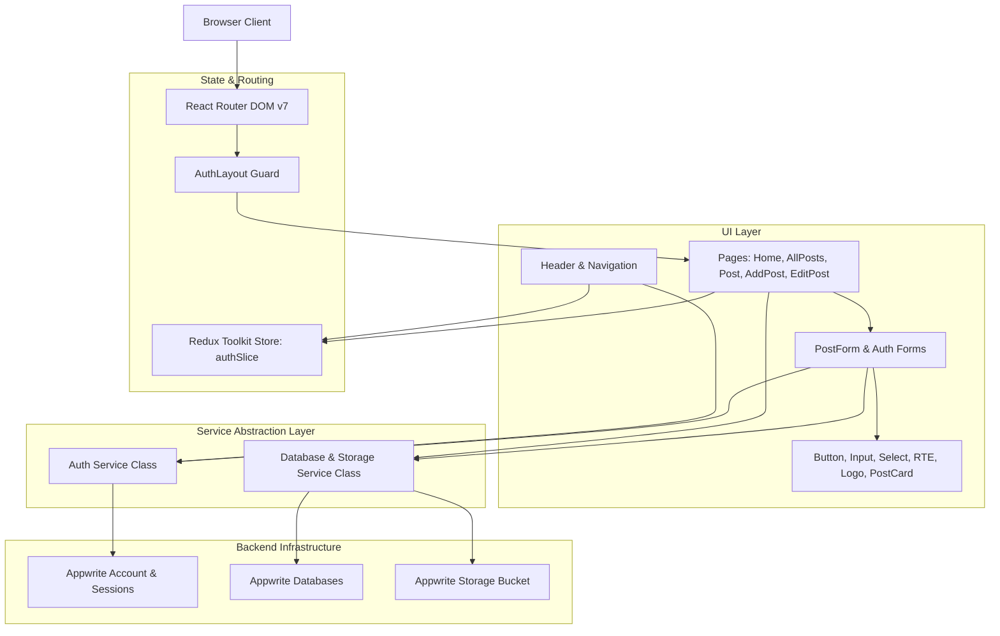

# InkSpace — React Mega Project

A modern, full-stack blogging platform built from the ground up as a comprehensive **React Mega Project**. This project was conceived and developed as an intensive, practical journey to master React, explore modern web application architecture, and understand how production-ready frontend systems communicate with Backend-as-a-Service (BaaS) ecosystems.

---

## Project Motivation & Philosophy

The primary objective of building this mega project was to go far beyond basic "todo app" tutorials and tackle the real-world complexities of building a full-featured web application:

- **Architectural Thinking:** Moving from ad-hoc component creation to a structured design system with reusable atoms, compound layouts, and singleton service abstraction layers.
- **State Architecture:** Understanding when to use local component state, when to lift state up, and when to delegate to a centralized global Redux store.
- **Data Flow & Lifecycle:** Navigating the subtle intricacies of asynchronous side-effects, session hydration, route guards, and cache synchronizations.
- **Production Resilience:** Handling real-world edge cases such as missing assets, offline capabilities, self-hosted vendor libraries, and unhandled promise rejections.

---

## Technology Stack & Why Each Was Chosen

Every technology and library in this project was deliberately selected to solve a distinct engineering problem and to gain deep insight into its underlying patterns.

### 1. React 19 (Core UI Engine)
- **Why It Was Chosen:** React remains the industry benchmark for component-driven interfaces. Learning React 19 allowed direct exposure to modern rendering behavior, clean hooks abstractions (`useState`, `useEffect`, `useCallback`, `useId`), forward references (`forwardRef`), and declarative JSX paradigms.
- **Key Concepts Learned:** 
  - Controlled vs. uncontrolled inputs.
  - Custom form controls integrated with `forwardRef` and unique IDs via `useId`.
  - Memoized utility functions with `useCallback` to prevent cascading hook re-triggers.
  - Designing composite component layouts with flexible slot patterns.

### 2. Vite (Next-Generation Build Tool)
- **Why It Was Chosen:** Traditional bundlers like Webpack or Create React App suffer from slow cold starts and sluggish rebuilds as projects scale. Vite leverages native ES Modules (ESM) in modern browsers alongside Rollup for production bundling.
- **Key Concepts Learned:**
  - Instantaneous Hot Module Replacement (HMR) for frictionless UI iteration.
  - Environment variable sandboxing via `import.meta.env`.
  - Static asset serving from the `public/` directory for zero-latency local vendor distribution.

### 3. Redux Toolkit & React-Redux (Global State Management)
- **Why It Was Chosen:** While small applications can rely on React Context, a publishing platform requires predictable, single-source-of-truth state management for authentication tokens and user profiles that avoid unnecessary re-renders across disparate tree branches.
- **Key Concepts Learned:**
  - Normalized slice design with `@reduxjs/toolkit` (`createSlice`).
  - Immutability management via Immer under the hood.
  - Predictable dispatch actions (`login`, `logout`) and reactive state consumption with `useSelector`.
  - Resilient session re-hydration: synchronizing client-side Redux memory with remote session state on initial application load.

### 4. React Router DOM v7 (Client-Side Routing & Guards)
- **Why It Was Chosen:** To provide a fluid Single-Page Application (SPA) experience without full browser page refreshes, complete with dynamic parameter extraction and route protection.
- **Key Concepts Learned:**
  - Data-driven route declarations using `createBrowserRouter` and `<RouterProvider>`.
  - Centralized application shell layouts utilizing `<Outlet />` for child route rendering.
  - Dynamic URL segments (`/post/:slug` and `/edit-post/:slug`) consumed with `useParams`.
  - Imperative route transitions via `useNavigate` and path observation with `useLocation`.
  - Building higher-order protection guards (`AuthLayout`) that evaluate authentication criteria before rendering child subtrees.

### 5. Appwrite (Backend-as-a-Service / BaaS)
- **Why It Was Chosen:** Rather than spending hundreds of hours writing repetitive backend boilerplate (databases, authentication routes, session cookies, storage parsers), Appwrite was chosen to provide enterprise-grade backend infrastructure through a clean client SDK.
- **Key Concepts Learned:**
  - **Account & Authentication:** Session creation, account provisioning, and credential verification via Appwrite Account APIs.
  - **Document Databases:** Managing collections, indexing, schema validations, and programmatic querying (`Query.equal('status', 'active')`).
  - **Storage Buckets:** Handling multi-part binary file uploads for featured cover images, unique ID generation (`ID.unique()`), and image preview transformations.
  - **Security & Permissions:** Navigating role-based access control (guests vs. authenticated users) and enforcing author-only document modifications.

### 6. React Hook Form (Performant Form Handling)
- **Why It Was Chosen:** Traditional React controlled form state can cause the entire component tree to re-render on every keystroke. React Hook Form isolates re-renders to individual fields, maximizing input performance.
- **Key Concepts Learned:**
  - Registering inputs via ref forwarding (`{...register("title", { required: true })}`).
  - Custom regex-based validation rules (e.g., email format verification).
  - Synchronizing complex form fields with third-party rich text editors through `<Controller>`.
  - Dynamic reactive slug generation from titles using `watch()` and `setValue()`.

### 7. Self-Hosted TinyMCE (WYSIWYG Rich Text Editor)
- **Why It Was Chosen:** Providing users with a full-featured publishing editor is essential for a blogging platform. However, default cloud-hosted editors require external API keys, enforce domain registrations, and show promotional banners.
- **Key Concepts Learned:**
  - Decoupling from external cloud CDNs by bundling and self-hosting TinyMCE's open-source GPL distribution (`license_key: 'gpl'`).
  - Configuring `tinymceScriptSrc="/tinymce/tinymce.min.js"` alongside local theme (`silver`), skin (`oxide`), and plugin paths.
  - Integrating third-party canvas editors into React Hook Form controlled states.
  - Ensuring 100% offline functionality without third-party rate limits or external dependencies.

### 8. HTML React Parser (Safe Rich Text Rendering)
- **Why It Was Chosen:** Storing articles as rich HTML requires converting that raw markup back into React Virtual DOM nodes without resorting to insecure primitives like `dangerouslySetInnerHTML`.
- **Key Concepts Learned:**
  - Safe conversion of server-stored HTML into native React elements.
  - Styling rendered markup uniformly using custom typography prose classes.

### 9. Modern CSS & Tailwind CSS v4 (Visual Design System)
- **Why It Was Chosen:** To build a bespoke, modern aesthetic without the bloat of heavy component libraries, giving complete control over colors, spacing, and micro-animations.
- **Key Concepts Learned:**
  - Designing a cohesive color palette: Slate canvas (`bg-slate-50`), rich Indigo/Violet brand gradients, and Emerald status pills.
  - Glassmorphic navigation bars with backdrop filters (`backdrop-blur-md bg-white/80`).
  - Polished micro-interactions: card elevation lifts on hover (`hover:-translate-y-1 hover:shadow-xl`), image zooms, and loading spinners.
  - Custom typography with Google Fonts (**Plus Jakarta Sans**) and article prose styling for headings, blockquotes, code snippets, and image figures.

---

## Architectural Patterns & System Design

### 1. The Service Layer Pattern
Instead of directly calling Appwrite SDK functions inside React components, all backend interactions are encapsulated into singleton service classes (`Auth` in `src/appwrite/auth.js` and `Service` in `src/appwrite/conf.js`).
- **Advantage:** Components remain pure UI handlers. If the backend is ever migrated (e.g., from Appwrite to Supabase or Firebase), only the service layer needs modification; the entire React component tree remains untouched.

### 2. The Container-Presentational Pattern
Reusable building blocks (`Input`, `Select`, `Button`, `Logo`, `PostCard`) are purely presentational: they take props, forward refs, and trigger callbacks. Stateful logic and API orchestration are isolated within page containers (`AddPost`, `EditPost`, `AllPosts`, `Post`).

### 3. Graceful Fallbacks & Defensive UI
- **Image Fallbacks:** If an image fails to load or an article has no uploaded asset, the UI gracefully renders a branded gradient cover rather than a broken image link.
- **Zero-Latency Vendor Serving:** Third-party vendor dependencies (TinyMCE) are bundled locally, eliminating external cloud CDN outages, license warnings, and network bottlenecks.
- **Search & Empty States:** Interactive real-time search filtering provides instant feedback, paired with helpful empty states for both unauthenticated visitors and logged-in writers.

---

## Core Engineering Lessons Learned

1. **State Ownership:** Not all data belongs in Redux. Form input values belong in form state (React Hook Form), modal visibility belongs in local state (`useState`), while authenticated identity belongs in global state (Redux).
2. **Synchronous Effect Pitfalls:** Invoking state updaters synchronously at the start of `useEffect` triggers cascading re-render cycles. Initializing state with default values and deriving boolean flags declaratively produces smoother, warning-free renders.
3. **Decoupled Architecture:** Wrapping third-party SDKs behind dedicated service wrappers creates cleaner code, simplifies debugging, and centralizes error handling.
4. **Design Precision Matters:** A well-considered color palette, consistent typography, responsive drawer navigation, and subtle micro-interactions transform a functional project into a memorable, consumer-grade product.

---

## Appwrite Backend Setup Instructions

### 1. Database Collection (`posts` / Articles)
To support multi-image galleries and PDF attachments, add the following attribute to your Posts collection in the Appwrite Console:

- **Navigate:** Databases &rarr; *[Your Database]* &rarr; *[Your Posts Collection]* &rarr; **Attributes**
- **Attribute Type:** `String`
- **Attribute Key:** `media`
- **Size:** `65535` (or at least `10000`)
- **Required:** `false` (Optional)
- **Default Value:** `[]` or leave empty

> **Note on Backward Compatibility:** Existing post documents without the `media` attribute will automatically default to an empty list `[]` without requiring a database migration. The existing `featuredimage` field continues to serve as the post cover.

### 2. Storage Bucket Permissions & Settings
Configure the Appwrite Storage bucket holding post cover images and attachments:

- **Navigate:** Storage &rarr; *[Your Bucket]* &rarr; **Settings**
- **Permissions:**
  - `Any` (Role: Guests / Visitors): **Read**
  - `Users` (Role: Authenticated Authors): **Create**, **Read**, **Update**, **Delete**
- **Maximum File Size:** `10 MB` (or higher)
- **Allowed File Extensions:** `png, jpg, jpeg, gif, webp, pdf`
- **Encryption / Antivirus:** Enabled according to your security policy

